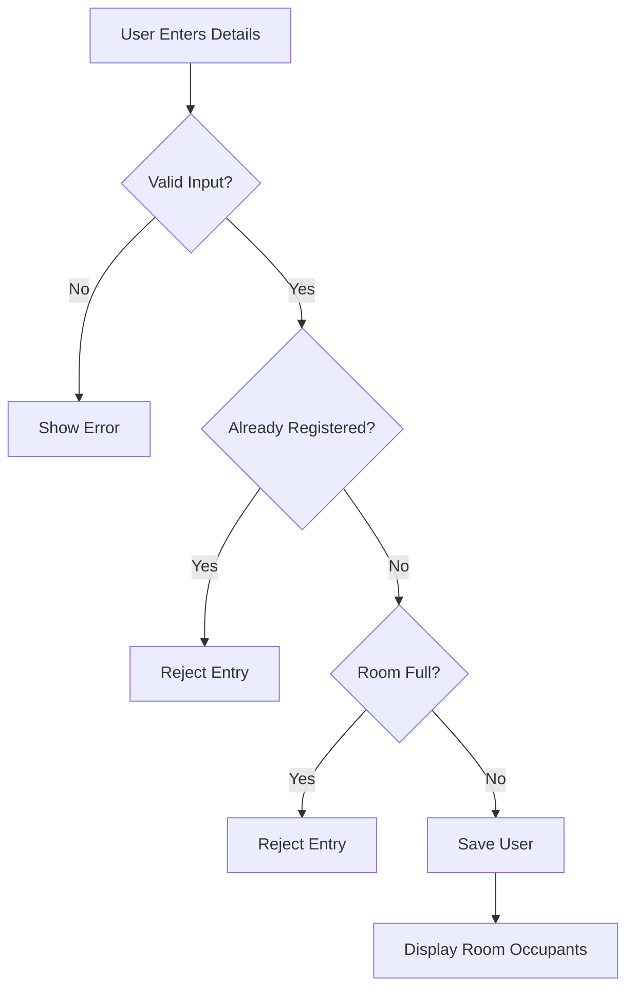

# 🏠 MIT Hostel Roommate Finder

<p align="center">
  <b>Find your hostel roommate before you even move in.</b><br/>
  A simple, fast, and intuitive platform for connecting students sharing the same room.
</p>

<p align="center">
  
  
  
</p>

---

## ✨ Overview

Moving into a hostel without knowing your roommate can be awkward.

**MIT Hostel Roommate Finder** solves this by allowing students to:

* Enter their room details
* Instantly discover who they’re sharing with
* Connect before arrival

> ⚡ Built for speed, simplicity, and real student needs.

---

## 🚀 Features

* 👤 **User Registration**

  * Name, Room Number, Phone Number

* 🏠 **Room-Based Matching**

  * Automatically groups users by room

* 🔄 **Real-Time Visibility**

  * If your roommate joins, you see them instantly

* 🚫 **Smart Constraints**

  * One user → One room
  * Maximum 2 occupants per room

* 📱 **Minimal & Clean UI**

  * Fast, distraction-free experience

---

## 🧠 How It Works



---

## 🛠️ Tech Stack

| Layer    | Technology             |
| -------- | ---------------------- |
| Frontend | HTML, CSS, JavaScript  |
| Storage  | LocalStorage (Browser) |
| Backend  | *(Planned: Supabase)*  |

---

## 📦 Getting Started

### 1. Clone the repository

```bash
git clone https://github.com/Nekhilesh-Agarwal/Mit-Hostel-Roommate-Finder.git
cd Mit-Hostel-Roommate-Finder
```

### 2. Run the project

Simply open:

```bash
index.html
```

> No installation required 🚀

---

## 📸 Screenshots

> *(Add your screenshots here for maximum impact)*

| Home Page                                | Room View                                |
| ---------------------------------------- | ---------------------------------------- |
|  |  |

---

## ⚙️ Core Logic

* Users are stored locally
* Room occupancy is dynamically calculated
* Constraints enforced before insertion
* UI updates instantly after submission

---

## 🔒 Limitations

* Data is stored in browser only (not shared globally)
* No authentication system yet
* No real-time sync across devices

---

## 🔮 Future Roadmap

* 🌐 Cloud backend (Supabase / Firebase)
* 🔐 Authentication (Login / Signup)
* 📊 Admin dashboard
* 🧠 AI-based roommate compatibility matching
* 📢 Notifications when roommate joins
* 📱 Mobile-first UI improvements
* 🚀 Full deployment (Vercel / AWS)

---

## 🤝 Contributors

* **Nekhilesh Agarwal**

---

## 📄 License

This project is licensed under the **MIT License**.

---

## 💡 Inspiration

Starting hostel life is a big transition.

This project aims to remove uncertainty and help students feel:

* More comfortable
* More connected
* Better prepared

---

## 🌟 Support

If you like this project:

⭐ Star the repo
🍴 Fork it
📢 Share it with your friends

---

<p align="center">
  Built with ❤️ by students, for students
</p>
